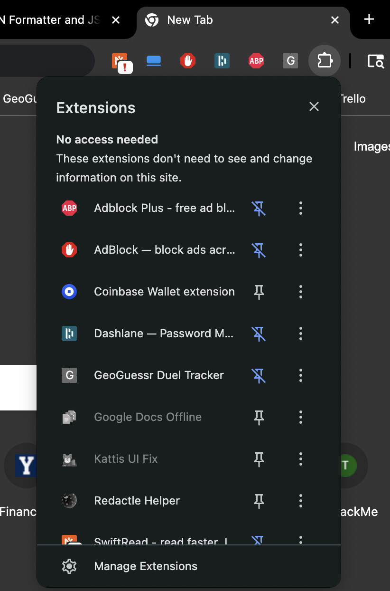
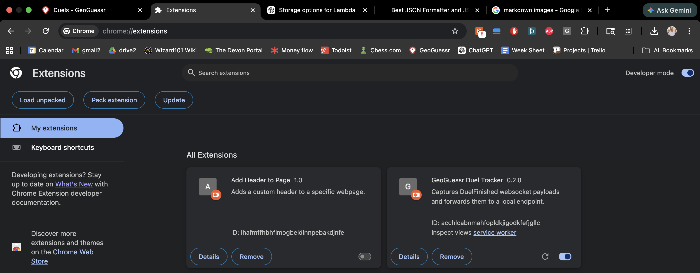
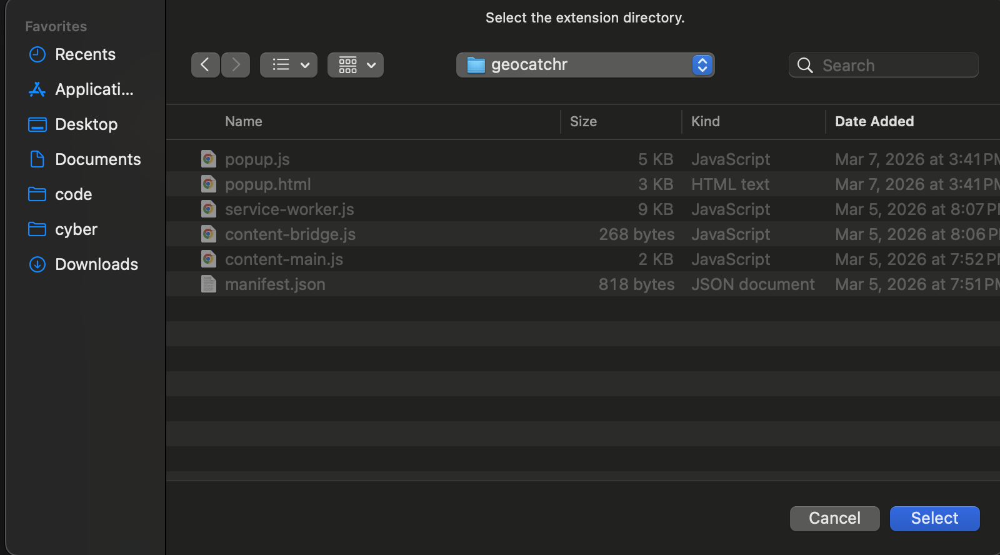
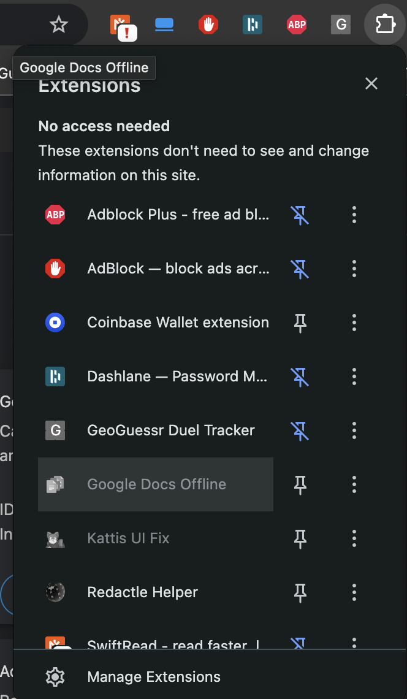

- Download geocatchr.zip and unzip it to a folder

- Open a new chrome window and click on Extensions > Manage Extensions

- Toggle on developer mode in the top right
- Click Load Unpacked in the top left

- Select the unzipped folder (should contain manifest.json)

- Pin the extension for easy access
- Click the extension logo and click sign in
- Proceed to make a new account
- Once signed in, play a round of geoguessr duels
- After the game is over, click the extension and click the refresh summary button to view your stats

## For future updates
- for right now, when there is a new update to the extension code specifically (not all platform updates will require frontend changes), simply unzip the new zip file and replace all of the contents of the old geocatchr folder (that you selected in the Manage Extensions page) with the new files
- Then, return to the Manage extensions page, and click the refresh button on the Geocatchr chrome extension